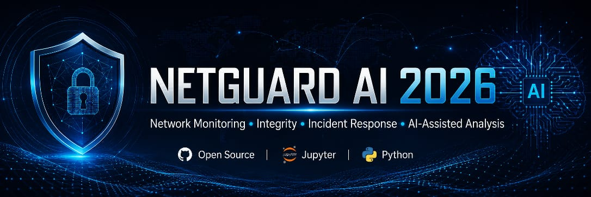
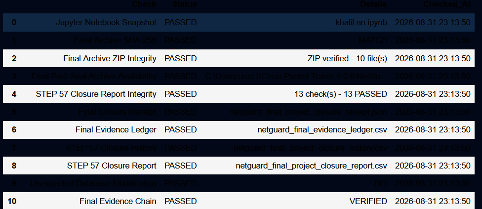
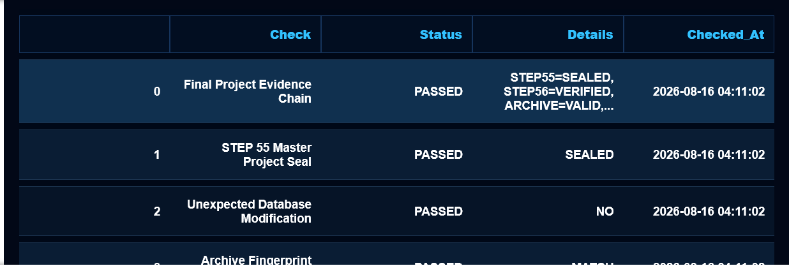
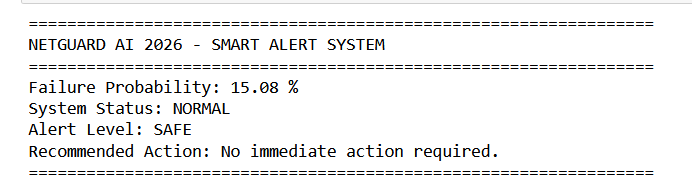
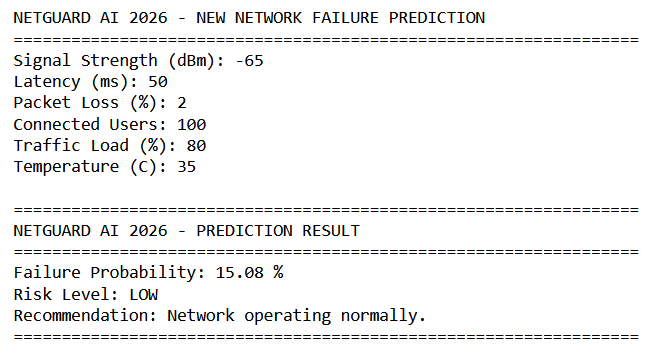
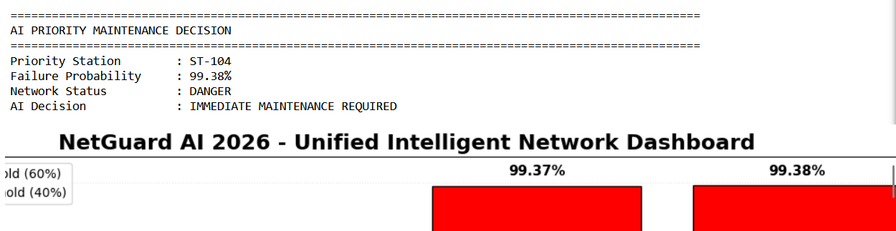

<p align="center">
  
</p>

# NETGUARD AI 2026
[](https://www.python.org/)
[](https://jupyter.org/)
[](LICENSE)
[](https://github.com/khalilnn10-design/NetGuard-AI-2026/releases/latest)
[](#)
[](#)
NETGUARD AI 2026 is an open-source academic network management,
monitoring, integrity verification, auditing, backup, recovery,
incident-response, and final-submission verification system.

## Main Features
## System Screenshots

### STEP 58 — Final Submission Verification
### AI Failure Prediction
### Smart Alert System


<p align="center">
  
</p>

Final submission integrity verification showing the project closure, archive integrity, evidence-chain validation, and final verification status.
<p align="center">
  
</p>

Final submission integrity closure showing the project closure, archive integrity, evidence-chain closure, and final verification status.
<p align="center">
  
</p>

Smart alert engine that converts AI failure probability into an operational alert level, network status, and recommended maintenance action.
<p align="center">
  
</p>

AI-assisted network failure analysis showing failure probability, predicted failure class, risk level, network status, and the recommended action.
### Unified Intelligent Network Dashboard

<p align="center">
  
</p>

AI-powered network monitoring dashboard showing failure probability, priority station, risk status, and the recommended maintenance decision.
- Network station management
- Data validation
- Audit logging
- Backup and recovery
- Database integrity verification
- Trusted baseline monitoring
- Change detection
- Operational monitoring
- Alert escalation
- Incident response
- Evidence chain verification
- SHA-256 integrity verification
- Final archive sealing
- Final submission freeze

## Technologies

- Python
- Pandas
- Jupyter Notebook
- ipywidgets
- JSON
- CSV
- SHA-256
- ZIP Archives

## Final Verification

NETGUARD AI 2026 completed its final submission verification with:

- 17 Total Checks
- 17 Passed
- 0 Failed
- 100% Submission Score
- Project State: CLOSED AND ARCHIVED
- Project Freeze: FROZEN
- Archive Lock: LOCKED
- Evidence Chain: VERIFIED

## Installation

```bash
pip install -r requirements.txt
jupyter notebook
